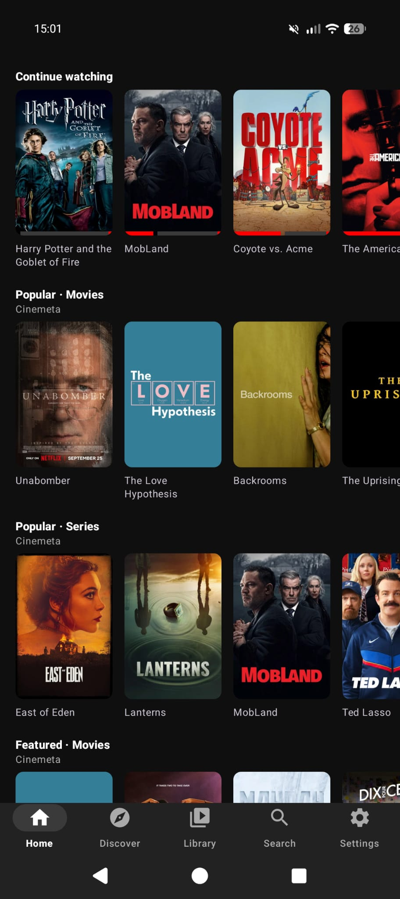
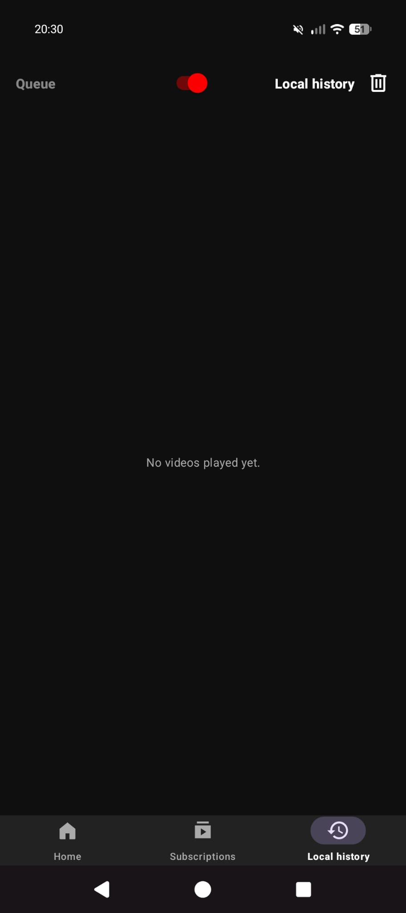

# niixfliix

A native Android app for the public Stremio add-on protocol. Browse movies and
series, open one, pick a stream, watch it. Any Stremio add-on works; Cinemeta,
Torrentio, ThePirateBay+ and OpenSubtitles come installed.

Android 8.0 (API 26) and newer.

The app is a player and add-on client. It contains no media and hosts no
streams. Torrentio and other add-ons are run by third parties, and you are
responsible for what you watch. niixfliix is not affiliated with Stremio.

## Playing torrents

Torrentio and ThePirateBay+ return torrent results. The streams list shows one
per quality (2K, 1080p, 720p, 480p), the one with the most seeds, and plays it
when tapped:

- **Debrid service (optional).** Enter a Real-Debrid, AllDebrid, Premiumize,
  Debrid-Link, TorBox or Offcloud key in the first-start popup. Torrentio then
  returns plain https links.
- **Built-in torrent engine.** Plays torrent results straight away when there's
  no ready link. It downloads through BitTorrent, so your IP address is visible
  to other peers. A Wi-Fi only switch is in Settings (off by default).

## Stremio account (optional)

Everything works without an account. Sign in with an existing Stremio account
(Settings, or the button in the first-start popup) and your Stremio add-ons,
including a debrid-configured Torrentio, and your library come into the app.
Saving or removing a title here updates your Stremio library too. Signing out
leaves your add-ons and library on the phone. Accounts can't be created in the
app.

## Watching

- Playback keeps going when you leave the player, with the usual media
  notification and lock-screen controls.
- Swipe down on the video, press back, or tap the arrow at the top: the app
  comes back with a mini bar at the bottom and the sound keeps playing, so you
  can browse and search. Tap the bar to get the picture back, its X stops
  playback. Picture in picture is a button in the player.
- Long-press any movie, show or episode to add it to the queue, play it next or
  mark it as watched. The queue is under Library and plays after the current
  video.
- A series plays its next episode on its own, and a film the next thing in the
  queue. "Up next" shows 5 minutes before the end and whatever comes next starts
  downloading in the background right then, torrents included. Once its start
  is in, it's lined up behind the current video, so it begins the moment this
  one ends. The next button in the player, the mini bar and the notification
  skips to it right away.
- The full screen button in the player's top bar switches between full screen
  (landscape) and portrait, with the video on top and the title, details and
  "Up next" under it. The player opens the way you left it.
- The lock button in the player's top bar ignores every touch and key until
  the lock is held for 5 seconds. Good for pockets and kids.
- Pick your language at first start: audio in it if the video has it,
  otherwise subtitles in it, otherwise English subtitles with the original
  audio.
- Whatever language the app is in, titles, descriptions and episode names
  follow it. Cinemeta only has English, so titles come from Wikidata and
  descriptions and episode names from the TMDB add-on; everything else (ids,
  episodes, streams) stays Cinemeta's. If one of them is slow or down, the
  other still fills in what it can, and the rest stays in English.
- Double-tap the sides to skip, pinch to zoom.
- Audio the phone can't decode itself (AC3, E-AC3, DTS, TrueHD, common in MKV
  releases) goes through a bundled FFmpeg decoder.

## Screenshots

## More

- [HOW-IT-WORKS.md](HOW-IT-WORKS.md): which servers the app talks to and why.
- License: the app's own code is MIT (see [LICENSE](LICENSE)). The APK also
  bundles Jellyfin's prebuilt FFmpeg audio decoder
  (`org.jellyfin.media3:media3-ffmpeg-decoder`), published under GPL-3.0, so an
  APK you distribute falls under GPL-3.0 terms and its source has to be
  available (Settings > About > Source code links to it). libtorrent4j is MIT, libtorrent is BSD, the rest is Apache 2.0 or BSD.
